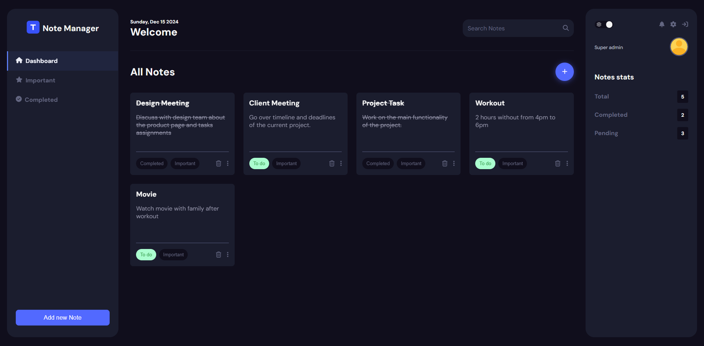
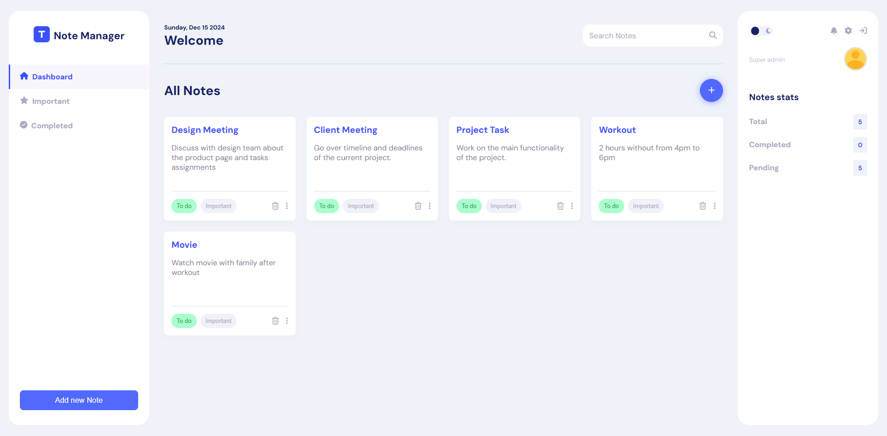

# Daily Notes Management Application

## Overview



---



The **Daily Notes Management Application** allows users to:

- Create, read, update, and delete notes.
- Add audio recordings to notes.
- Securely store and retrieve audio files, ensuring they are accessible only to
  authenticated users.

The application is built using **Django REST Framework** for the backend and
**React** (with **Vite**) for the frontend.

---

## Assumptions

1. **Authentication**:
   - Users must be authenticated to access or manage notes.
   - JWT (JSON Web Tokens) is used for authentication. Tokens are currently
     stored in **localStorage** but will transition to **HTTP-only cookies** for
     better security in the future.
2. **Audio Files**:
   - Only audio recordings made in-app are allowed; uploading pre-recorded files
     is not supported.
   - Audio files are saved on the server and linked to their respective notes.
3. **Styling**:
   - Future frontend styling will utilize **Tailwind CSS** for maintainable and
     consistent design.
4. **Environment**:
   - The application assumes a modern browser environment for audio recording.
   - Development and production environments are configured for different
     backend and frontend endpoints.

---

## Technical Design and Architecture

### 1. **Backend**

- **Framework**: Django REST Framework
- **Authentication**: Simple JWT for token-based authentication
- **Database**: **PostgreSQL** for scalability and production readiness
- **Storage**:
  - Audio files are stored in a directory on the server, and their URLs are
    saved in the database.
- **Key Features**:
  - CRUD operations for notes
  - Audio file upload and retrieval
  - Permissions to ensure only authenticated users can access their data

#### Database Schema (PostgreSQL)

The application uses the following schema:

##### `User`

| Field        | Type         | Description              |
| ------------ | ------------ | ------------------------ |
| `id`         | UUID         | Unique identifier        |
| `email`      | VARCHAR(255) | User email (unique)      |
| `password`   | VARCHAR(128) | Hashed password          |
| `created_at` | TIMESTAMP    | Timestamp of creation    |
| `updated_at` | TIMESTAMP    | Timestamp of last update |

##### `Note`

| Field          | Type              | Description                   |
| -------------- | ----------------- | ----------------------------- |
| `id`           | UUID              | Unique identifier             |
| `user_id`      | UUID (FK to User) | Foreign key to `User` table   |
| `title`        | VARCHAR(200)      | Title of the note             |
| `description`  | TEXT              | Content of the note           |
| `is_completed` | BOOLEAN           | Mark if the note is completed |
| `is_important` | BOOLEAN           | Mark if the note is important |
| `audio`        | VARCHAR(255)      | Path to the audio file        |
| `created_at`   | TIMESTAMP         | Timestamp of creation         |
| `updated_at`   | TIMESTAMP         | Timestamp of last update      |

---

### 2. **Frontend**

- **Framework**: React (with Vite for fast development and bundling)
- **Styling**: Planned integration of **Tailwind CSS** for component-based
  styling.
- **State Management**: Context API for managing global application state.
- **Audio Recording**: `react-media-recorder` library for recording audio.
- **File Upload**: Handled using the `FormData` API.
- **Testing**: Jest and React Testing Library for unit and integration tests.

---

## Running the Application

### Prerequisites

- **Node.js**: v16 or later
- **Python**: 3.8 or later
- **PostgreSQL**: v13 or later
- **pip**: Python package manager
- **Virtual Environment**: Recommended for Python dependencies

---

### Backend Setup

1. Clone the repository:
   ```bash
   git clone <repository-url>
   cd backend
   ```
2. Create and activate a virtual environment:
   ```bash
   python -m venv venv
   source venv/bin/activate  # On Windows: venv\Scripts\activate
   ```
3. Install dependencies:
   ```bash
   pip install -r requirements.txt
   ```
4. Set up the database in **settings.py**:
   ```bash
   DATABASES = {
    'default': {
        'ENGINE': 'django.db.backends.postgresql',
        'NAME': 'your_db_name',
        'USER': 'your_db_user',
        'PASSWORD': 'your_db_password',
        'HOST': 'localhost',
        'PORT': '5432',
    }
   }
   ```
5. Run migrations:
   ```bash
   python manage.py migrate
   ```
6. Start the backend server:
   ```bash
   python manage.py runserver
   ```

---

### Frontend Setup

1. Navigate to the client directory:
   ```bash
   git clone <repository-url>
   cd client
   ```
2. Install dependencies:
   ```bash
   npm install
   ```
3. Start the frontend server:
   ```bash
   npm run dev
   ```
   The frontend should now be running at **http://localhost:5173**.

---

## Testing

### Backend Tests

1. Navigate to the backend directory:

```bash
Copy code
cd backend
```

Run the tests:

```bash
Copy code
python manage.py test
```

### Frontend Tests

1. Navigate to the frontend directory:

```bash
Copy code
cd client
```

Run the tests:

```bash
Copy code
npm test
```

---

## Future Enhancements

### Backend

- **Token Security**: Transition to storing tokens in HTTP-only cookies.
- **Cloud Storage**: Store audio files in AWS S3 or Google Cloud Storage for
  improved scalability.

### Frontend

- **Styling**: Use Tailwind CSS for a modern, responsive, and consistent UI.
- **Notification**: Add notification for the api response.
- **Audio Features**: Add functionality for trimming, editing, and previewing
  audio recordings before saving.
- **Search and Filter**: Enable search and filtering of notes by title,
  description, importance, or date.
